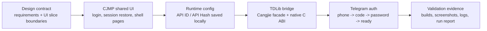
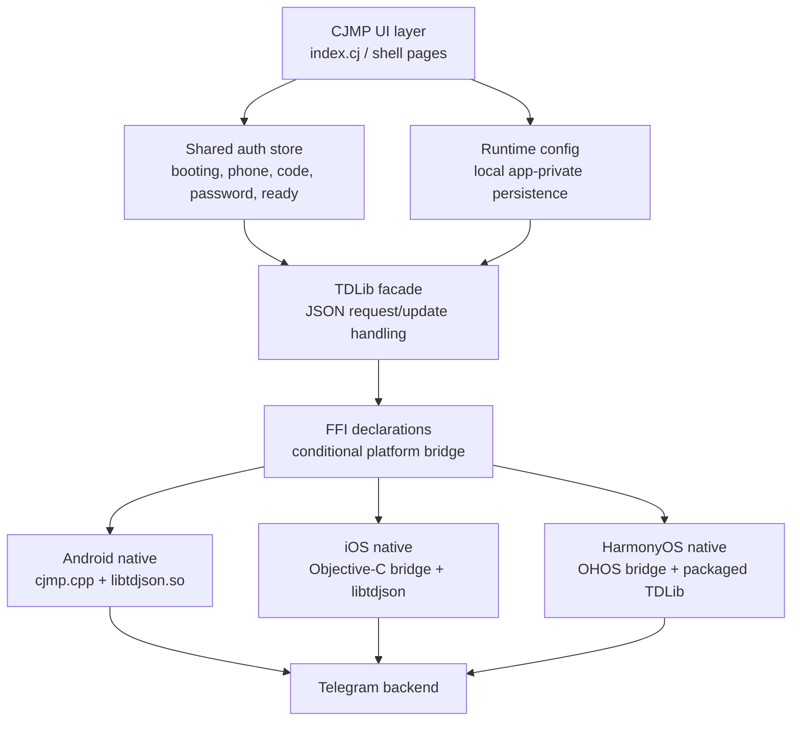

# CJMP-Telegram

CJMP Telegram MVP: from design contract to real TDLib-backed login flow

# PR Description

  
  
  

## Overview

This PR captures the next major step of the CJMP Telegram-like commercial demo: moving from a polished offline UI shell toward a real Telegram runtime path powered by TDLib, while keeping the project useful as an AI-assisted development benchmark.

The work is intentionally structured as a comparable delivery slice: product design, CJMP implementation, platform bridge work, runtime configuration, device validation, and AI-delivery friction are all recorded so CJMP can be compared against KMP-style workflows on credible mobile-app tasks.

## Product Flow

## What Changed

| Area | What this PR delivers | Why it matters |
|---|---|---|
| Product slice | Telegram-like login shell, credential input, keep-signed-in flow, and restore path | Keeps the UI close to a real commercial messaging app instead of a toy demo |
| Runtime config | `api_id` / `api_hash` are entered at runtime and persisted in app-private storage | Avoids committing private credentials while supporting real TDLib login |
| TDLib integration | Shared Cangjie auth state machine plus Android / iOS / HOS native bridge hooks | Moves backend access into reusable CJMP code instead of per-platform business logic |
| Network behavior | Emulator-only proxy relay support remains internal; user-facing proxy UI is removed | Preserves real-device UX while keeping emulator validation reproducible |
| Traceability | Design docs, run report, screenshots, and validation notes are checked into the repo | Makes the AI-assisted delivery process auditable and comparable |

## Visual Walkthrough

<table>
  <tr>
    <td align="center"><strong>1. Telegram-style login entry</strong></td>
    <td align="center"><strong>2. Runtime credentials entered locally</strong></td>
    <td align="center"><strong>3. Submit and advance auth state</strong></td>
  </tr>
  <tr>
    <td></td>
    <td></td>
    <td></td>
  </tr>
</table>

<table>
  <tr>
    <td align="center"><strong>4. Retry and validation states</strong></td>
    <td align="center"><strong>5. Current login surface</strong></td>
    <td align="center"><strong>6. Final captured state</strong></td>
  </tr>
  <tr>
    <td></td>
    <td></td>
    <td></td>
  </tr>
</table>

## Technical Pipeline

## AI-Assisted Delivery Process

| Step | Input | Output |
|---|---|---|
| 1. Product contract | Telegram-like MVP requirements and slice boundaries | Scope-controlled implementation plan |
| 2. UI implementation | Design tokens, copy, selectors, CJMP components | Login and shell UI aligned with the commercial demo bar |
| 3. Backend bridge | TDLib JSON client semantics and existing native probes | Reusable TDLib client bridge across platforms |
| 4. Debug loop | Device logs, screenshots, local runtime state | Fixes for startup order, credential persistence, and auth-state transitions |
| 5. Acceptance evidence | Build logs, screenshots, app-private config checks | `doc/run_report.md` plus reproducible validation artifacts |
| 6. Friction capture | CJMP / tooling limitations hit during delivery | Repo-level AI-efficiency issues and follow-up notes |

## Security Notes

- Telegram `api_id` and `api_hash` are not meant to be hardcoded in source.
- Runtime credentials are saved only in app-private storage.
- Sensitive TDLib payloads such as phone number, API hash, login code, password, and encryption key are redacted from native logs.
- The checked-in screenshots and reports should remain free of real private credential values before merge.

## Validation

| Check | Status | Evidence |
|---|---:|---|
| Android CJMP build / APK packaging | Passed | See `doc/run_report.md` |
| iOS simulator / device build path | Passed | See `doc/run_report.md` |
| Login UI screenshot capture | Passed | `doc/cjmp-login.png`, `doc/current-login.png` |
| Runtime credential persistence path | Passed | `telegramTdRuntimeConfig` app-private storage path documented in code |
| Telegram auth progression evidence | Partially device-gated | Requires real API credentials, phone number, and live code entry |

## Reviewer Guide

Recommended review order:

1. Start with `docs/design/telegram-commercial-cjmp-tdlib-login-slice.md` to understand the intended slice boundary.
2. Read `apps/cjmp/lib/index.cj` for the user-facing login flow.
3. Read `apps/cjmp/lib/telegram_runtime_config.cj` and `apps/cjmp/lib/telegram_auth_store.cj` for credential persistence and auth state.
4. Read `apps/cjmp/lib/telegram_tdlib_facade.cj` and `apps/cjmp/lib/telegram_tdlib_bridge.cj` for the TDLib request / polling flow.
5. Use `doc/run_report.md` as the implementation and validation trail.

## Known Follow-ups

- Full end-to-end Telegram login still requires a live user-controlled verification code.
- Android UI automation remains limited when CJMP controls are not fully exposed through `uiautomator`.
- Long-term production config should replace the current development-friendly runtime credential entry.
- Framework comparison should continue on comparable CJMP / KMP slices rather than isolated feature demos.

