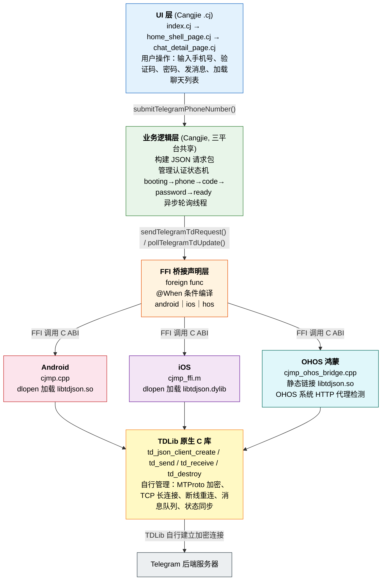

# Telegram-like CJMP 应用 AI 开发技术流程

## 1. 项目概览

用 CJMP（仓颉跨平台框架）构建一个接近 Telegram 真实体验的商业 Demo，验证 AI 辅助开发在跨平台移动应用场景下的完整链路。项目分两大阶段：**先完成离线 UI MVP，再接入真实 Telegram 后端**。

***

## 2. 前端设计

### 2.1 离线 MVP 按 Slice 逐步交付

前端离线 MVP 按 6 个 slice 推进，严格防止 AI 提前实现后续功能：

| Slice | 内容                | 对应页面                   |
| ----- | ----------------- | ---------------------- |
| 1     | App shell + 启动路由  | 登录壳层                   |
| 2     | Demo 登录流程         | 手机号 + 验证码页             |
| 3     | Session restore   | 本地 session 恢复          |
| 4     | Home shell + 聊天列表 | 三 Tab 首页 + 聊天列表        |
| 5     | 聊天详情              | 聊天详情页                  |
| 6     | Composer + 本地消息发送 | 消息输入 + pending→sent 状态 |

### 2.2 AI 辅助设计流程

前端页面通过 **Figma 设计资产 + 设计合同文档 + AI 辅助编码** 三层协作完成：

1. **Figma 设计板**提供 UI 视觉参考：`docs/design/figma-source/index.html` 包含 7 个核心屏幕原型（Login、Verification、Chat List、Chat Detail、Contacts、Settings），集成 Figma MCP 捕获脚本，可直接导入 Figma
2. **共享设计资产**提供规范级参考：`shared/design/telegram-commercial-mvp/` 包含 `design-tokens.json`（颜色/排版/间距/圆角）、`shared-copy.json`（所有用户可见文本）、`shared-mock-data.json`（种子数据）、12 个规范化 SVG 图标
3. **设计合同文档**约束 AI 实现：`docs/design/telegram-commercial-mvp.md` 定义每个 slice 的页面结构、视觉层级和交互形态，明确 `Must Not Be Implemented Yet` 防止 AI 提前实现

### 2.3 AI 如何实现页面

| AI 辅助能力                        | 具体作用                                                                                                                                              |
| ------------------------------ | ------------------------------------------------------------------------------------------------------------------------------------------------- |
| **Figma MCP**                  | 读取 Figma 设计板中的屏幕布局、组件层级和视觉规格，减少跨框架设计漂移                                                                                                            |
| **Context7 MCP**               | 查询 `walter-MITTY-PRO/cangjie-corpus` 获取 CJ-UI 声明式组件文档（`@Entry`/`@Component`、`Column`/`Row`/`Text`/`TextInput`/`Tabs`、`Router.push`/`Router.back`） |
| **cangjie-lang-features**      | 确认仓颉语法：类型系统、泛型、模式匹配、条件编译 `@When[target_platform == ...]`                                                                                          |
| **cangjie-std / cangjie-stdx** | 查询标准库：集合操作、JSON 编解码、并发同步、文件系统                                                                                                                     |
| **cangjie-regulations**        | 确认项目规范：命名规范、错误处理规范、安全规范                                                                                                                           |

**典型流程**：AI 读取设计合同 → 通过 Figma MCP 理解视觉规格 → 通过 Context7 查询 CJ-UI 组件用法 → 参照 design-tokens 和 shared-copy 编写仓颉代码 → 构建验证

### 2.4 实现结果

| 页面       | 完成功能                                               |
| -------- | -------------------------------------------------- |
| 登录页      | Telegram 品牌标识（app-mark.svg）+ 手机号输入 + 验证码认证         |
| 首页 Tab  | Chats / Contacts / Settings，Tab 图标使用规范 SVG 资源      |
| 聊天列表     | 头像（avatar-placeholder.svg）、标题、摘要、时间、未读数、置顶/静音标记    |
| 聊天详情     | incoming / outgoing 气泡区分、时间分隔、发送状态（pending → sent） |
| Contacts | 搜索 + 分组展示                                          |
| Settings | profile 信息 + 分组入口                                  |

***

## 3. 前端自动化测试

### 3.1 iOS：cjmp-ui-test Skill

| AI 辅助能力                | 具体作用                                                                                       |
| ---------------------- | ------------------------------------------------------------------------------------------ |
| **cjmp-ui-test Skill** | 封装完整的 iOS smoke 测试链路：app 内 smoke entry → `ohos.ui_test` 断言 → Xcode UI Test shell 驱动 → 截图导出 |

**实现方式**：App 内提供 smoke entry 页面和 selector 常量，`ohos.ui_test` 执行内部断言，外层 Xcode UI Test shell 负责启动和驱动，通过截图和 terminal status 判断结果。

**踩坑与解决**：`ohos.ui_test` driver 断言编译能通过，但在 app process 内直接调用会运行时报 `BusinessException 17000003`。最终方案：app 内只暴露 smoke 入口和状态，driver 断言交给外部 automation harness 执行。

### 3.2 Android：android-emulator-acceptance Skill

| AI 辅助能力                               | 具体作用                                                                                  |
| ------------------------------------- | ------------------------------------------------------------------------------------- |
| **android-emulator-deploy-run Skill** | 模拟器生命周期管理：boot / install APK / deploy / run / stop / shutdown，自动禁用动画减少测试抖动            |
| **android-emulator-acceptance Skill** | 验收交互层：`uiautomator dump` 获取 UI 层级 → Selector 语义匹配或坐标点击 → `screencap` 截图 → logcat 日志采集 |

**实现方式**：Android 同样通过自动化测试工具进行验收。Skill 封装了 `adb shell uiautomator dump` → 解析 XML → Selector 匹配（text / resource-id / content-desc）→ `adb shell input tap` 点击 → `adb exec-out screencap -p` 截图的完整链路。

**运行时兼容性问题**：CJMP Android 渲染层不把内部控件（TextInput、Button 等）作为 `uiautomator` 可发现节点导出，`uiautomator dump` 只能看到根 `FrameLayout`。这导致 Selector 语义匹配失效，验收不得不 fallback 到坐标点击 + 截图 + logcat 组合方案，解决问题方案使用新版CJMP SDK 0.2.2 及以上版本。该问题已沉淀为 CJMP issue，推动后续改善 accessibility 暴露。

## 4. 后端接入：TDLib 集成

### 4.1 AI 辅助接入流程

后端接入通过 **设计文档 + 最小实现参考 + TDLib 官方文档** 三重引导完成：

| AI 辅助能力                         | 具体作用                                                                                                                                    |
| ------------------------------- | --------------------------------------------------------------------------------------------------------------------------------------- |
| **最小实现**                        | 实现 `minimal-telegram-test` 工程，最简形式实现cangjie语言调用libtd库，打通链路。                                                                             |
| **设计文档**                        | 根据最小实现以及AI查询已有的TDLib 连接方案，得到 `docs/requirements/telegram-commercial-cjmp-tdlib-integration-plan.md`  ，并在已有的UI设计文档上，更新部分UI设计，比如二次登陆页面添加等 |
| **Context7 MCP**                | 查询 `/websites/core_telegram_tdlib` 获取 TDLib 官方文档，确认授权状态机、JSON client 语义、proxy API 等关键接口，避免凭记忆写接口                                        |
| **cangjie-stdx Skill**          | 查询 JSON 编解码、并发同步等扩展库用法                                                                                                                  |
| **cangjie-original-docs Skill** | 兜底检索仓颉 FFI、foreign func、条件编译等原始文档                                                                                                       |

### 4.2 技术选型：为什么选择 TDLib tdjson

- TDLib 官方提供 C/JSON 接口，适合跨语言 FFI 调用
- Android 和 iOS 共用一套 JSON request/update 处理逻辑
- 避免分别依赖平台 Java/ObjC 高层封装
- 状态机和数据模型尽量放在 CJMP 共享层

### 4.3 接入后端整体逻辑流程



### 4.4 授权状态机

AI 通过 Context7 查询 TDLib 文档后，按 authorization state 实现完整登录链路：

```
创建 TDLib client → 启动异步 poll 线程
    ↓
authorizationStateWaitTdlibParameters → 发送 setTdlibParameters
    ↓
authorizationStateWaitEncryptionKey → 发送 checkDatabaseEncryptionKey
    ↓
authorizationStateWaitPhoneNumber → 用户输入手机号 → 发送 setAuthenticationPhoneNumber
    ↓
authorizationStateWaitCode → 用户输入验证码 → 发送 checkAuthenticationCode
    ↓
authorizationStateWaitPassword → 用户输入二次密码 → 发送 checkAuthenticationPassword
    ↓
authorizationStateReady → 进入 HomeShellPage
```

AI 思考设计决策：

- **Poll/Drain 模型**：仓颉 `spawn` 线程 + 非阻塞 poll + 250ms 空闲休眠，避免复杂 callback 反调
- **代理延迟机制**：若配置了代理但尚未就绪，暂存授权状态，等 `addedProxy` update 到达后再推进
- **敏感信息脱敏**：`SummarizeTdlibPayloadForLog` 自动过滤 phone\_number、api\_hash、code、password
- **API ID / API hash 不硬编码**，通过运行时配置注入

### 4.5 当前验收结果

| 能力                     | 状态                                                  |
| ---------------------- | --------------------------------------------------- |
| TDLib 可行性验证            | Android / iOS / OHOS 均通过                            |
| 真实登录链路                 | 可进入验证码页                                             |
| 真实 session restore     | 保留 TDLib session 后直接进入首页                            |
| 真实 chat list           | 展示 TDLib 聊天列表和 last-message preview                 |
| 真实 Settings / Contacts | 显示真实 Telegram profile；Contacts 显示真实空态               |
| 真实 sendMessage         | 从 chat UI 发消息，TDLib 返回 `updateMessageSendSucceeded` |
| 真实 chat history        | chat detail 加载 TDLib 历史消息                           |

**当前实现功能**：CJMP 已不只是离线 UI demo，而是可以在真实 Telegram session 下展示真实数据、完成真实消息发送。

***

## 5. 演示视频

<!-- 视频将在此处插入 -->

***

## 6. 后续规划


